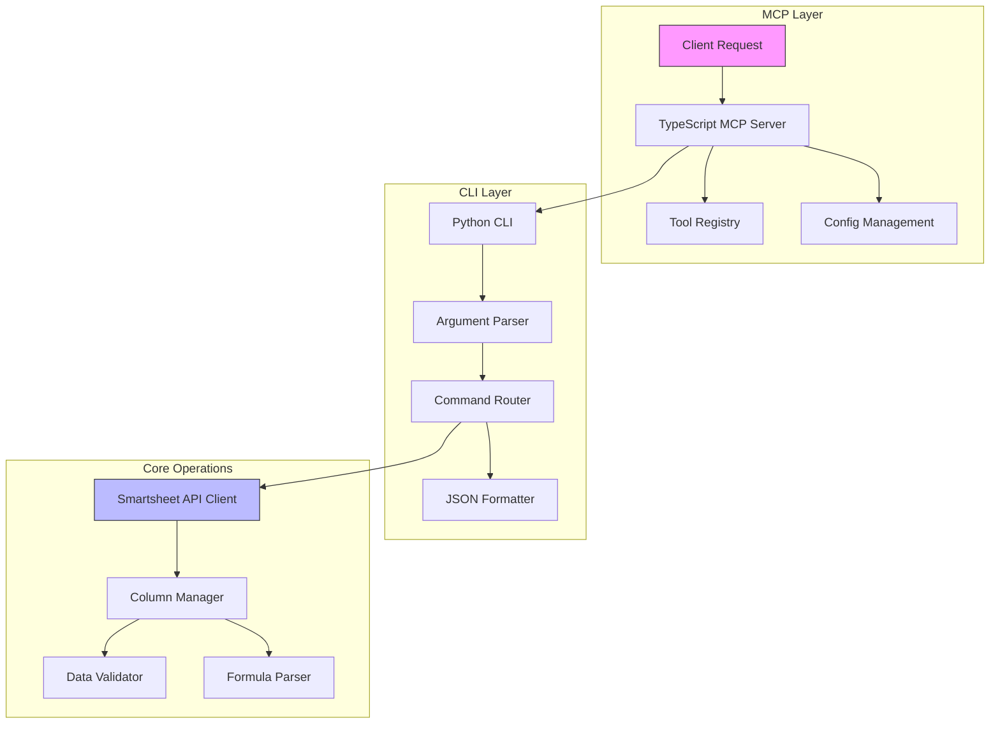
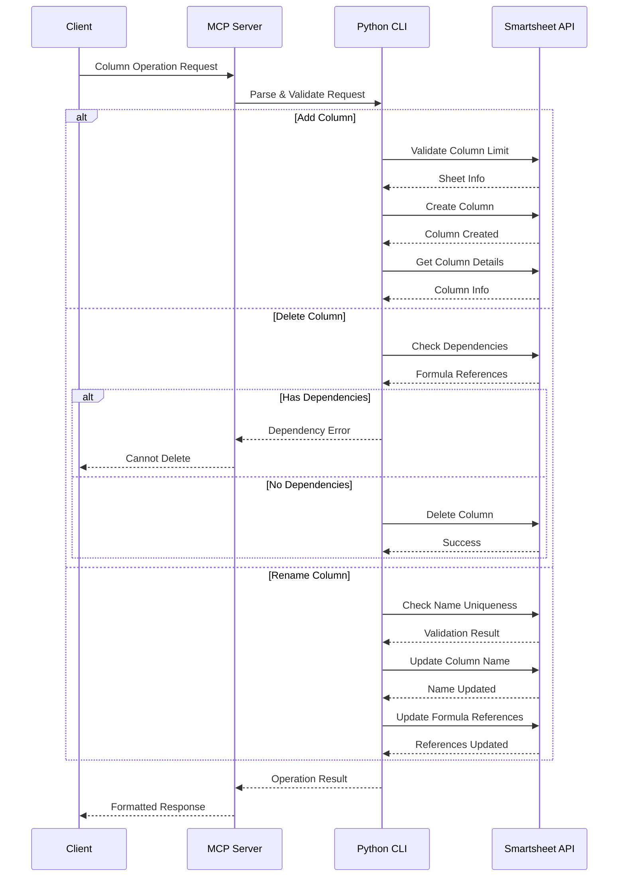
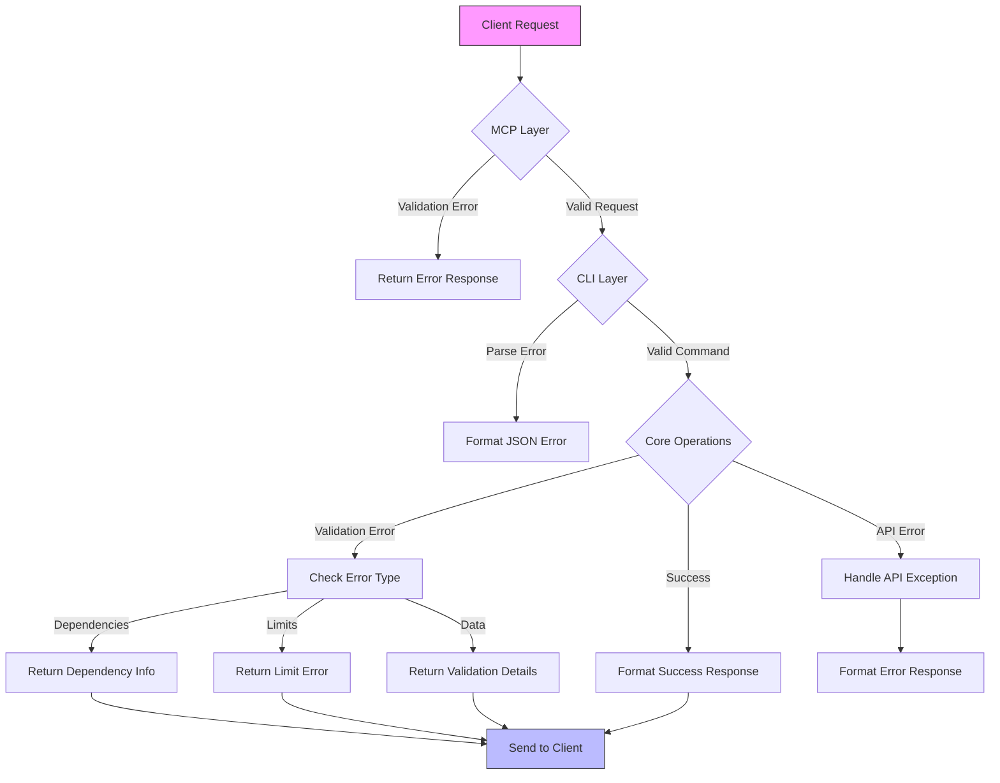

# Smartsheet MCP Server

A Model Context Protocol (MCP) server that provides seamless integration with Smartsheet, enabling automated operations on Smartsheet documents through a standardized interface. This server bridges the gap between AI-powered automation tools and Smartsheet's powerful collaboration platform.

## Overview

The Smartsheet MCP Server is designed to facilitate intelligent interactions with Smartsheet, providing a robust set of tools for document management, data operations, and column customization. It serves as a critical component in automated workflows, enabling AI systems to programmatically interact with Smartsheet data while maintaining data integrity and enforcing business rules.

### Key Benefits

- **Intelligent Integration**: Seamlessly connects AI systems with Smartsheet's collaboration platform
- **Data Integrity**: Enforces validation rules and maintains referential integrity across operations
- **Formula Management**: Preserves and updates formula references automatically
- **Flexible Configuration**: Supports various column types and complex data structures
- **Error Resilience**: Implements comprehensive error handling and validation at multiple layers
- **Healthcare Analytics**: Specialized analysis capabilities for clinical and research data
- **Batch Processing**: Efficient handling of large healthcare datasets
- **Custom Scoring**: Flexible scoring systems for healthcare initiatives and research

### Use Cases

1. **Clinical Research Analytics**

   - Protocol compliance scoring
   - Patient data analysis
   - Research impact assessment
   - Clinical trial data processing
   - Automated research note summarization

2. **Hospital Operations**

   - Resource utilization analysis
   - Patient satisfaction scoring
   - Department efficiency metrics
   - Staff performance analytics
   - Quality metrics tracking

3. **Healthcare Innovation**

   - Pediatric alignment scoring
   - Innovation impact assessment
   - Research prioritization
   - Implementation feasibility analysis
   - Clinical value assessment

4. **Automated Document Management**

   - Programmatic sheet structure modifications
   - Dynamic column creation and management
   - Automated data validation and formatting

5. **Data Operations**

   - Bulk data updates with integrity checks
   - Intelligent duplicate detection
   - Formula-aware modifications

6. **System Integration**
   - AI-driven sheet customization
   - Automated reporting workflows
   - Cross-system data synchronization

### Integration Points

The server integrates with:

- Smartsheet API for data operations
- MCP protocol for standardized communication
- Local development tools via stdio interface
- Monitoring systems through structured logging

## Architecture

The server implements a bridge architecture between MCP and Smartsheet:



1. **TypeScript MCP Layer** (`src/index.ts`)

   - Handles MCP protocol communication
   - Registers and manages available tools
   - Routes requests to Python implementation
   - Manages configuration and error handling

2. **Python CLI Layer** (`smartsheet_ops/cli.py`)

   - Provides command-line interface for operations
   - Handles argument parsing and validation
   - Implements duplicate detection
   - Manages JSON data formatting

3. **Core Operations Layer** (`smartsheet_ops/__init__.py`)
   - Implements Smartsheet API interactions
   - Handles complex column type management
   - Provides data normalization and validation
   - Manages system columns and formula parsing

### Column Management Flow



### Error Handling Flow



## Features

### Tools

1. `get_column_map` (Read)

   - Retrieves column mapping and sample data from a Smartsheet
   - Provides detailed column metadata including:
     - Column types (system columns, formulas, picklists)
     - Validation rules
     - Format specifications
     - Auto-number configurations
   - Returns sample data for context
   - Includes usage examples for writing data

2. `smartsheet_write` (Create)

   - Writes new rows to Smartsheet with intelligent handling of:
     - System-managed columns
     - Multi-select picklist values
     - Formula-based columns
   - Implements automatic duplicate detection
   - Returns detailed operation results including row IDs

3. `smartsheet_update` (Update)

   - Updates existing rows in a Smartsheet
   - Supports partial updates (modify specific fields)
   - Maintains data integrity with validation
   - Handles multi-select fields consistently
   - Returns success/failure details per row

4. `smartsheet_delete` (Delete)

   - Deletes rows from a Smartsheet
   - Supports batch deletion of multiple rows
   - Validates row existence and permissions
   - Returns detailed operation results

5. `smartsheet_add_column` (Column Management)

   - Adds new columns to a Smartsheet
   - Supports all column types:
     - TEXT_NUMBER
     - DATE
     - CHECKBOX
     - PICKLIST
     - CONTACT_LIST
   - Configurable options:
     - Position index
     - Validation rules
     - Formula definitions
     - Picklist options
   - Enforces column limit (400) with validation
   - Returns detailed column information

6. `smartsheet_delete_column` (Column Management)

   - Safely deletes columns with dependency checking
   - Validates formula references before deletion
   - Prevents deletion of columns used in formulas
   - Returns detailed dependency information
   - Supports force deletion option

7. `smartsheet_rename_column` (Column Management)

   - Renames columns while preserving relationships
   - Updates formula references automatically
   - Maintains data integrity
   - Validates name uniqueness
   - Returns detailed update information

8. `smartsheet_bulk_update` (Conditional Updates)

   - Performs conditional bulk updates based on rules
   - Supports complex condition evaluation:
     - Multiple operators (equals, contains, greaterThan, etc.)
     - Type-specific comparisons (text, dates, numbers)
     - Empty/non-empty checks
   - Batch processing with configurable size
   - Comprehensive error handling and rollback
   - Detailed operation results tracking

9. `start_batch_analysis` (Healthcare Analytics)

   - Processes entire sheets or selected rows with AI analysis
   - Supports multiple analysis types:
     - Summarization of clinical notes
     - Sentiment analysis of patient feedback
     - Custom scoring for healthcare initiatives
     - Research impact assessment
   - Features:
     - Automatic batch processing (50 rows per batch)
     - Progress tracking and status monitoring
     - Error handling with detailed reporting
     - Customizable analysis goals
     - Support for multiple source columns

10. `get_job_status` (Analysis Monitoring)

    - Tracks batch analysis progress
    - Provides detailed job statistics:
      - Total rows to process
      - Processed row count
      - Failed row count
      - Processing timestamps
    - Real-time status updates
    - Comprehensive error reporting

11. `cancel_batch_analysis` (Job Control)
    - Cancels running batch analysis jobs
    - Graceful process termination
    - Maintains data consistency
    - Returns final job status

### Key Capabilities

- **Column Type Management**

  - Handles system column types (AUTO_NUMBER, CREATED_DATE, etc.)
  - Supports formula parsing and dependency tracking
  - Manages picklist options and multi-select values
  - Comprehensive column operations (add, delete, rename)
  - Formula reference preservation and updates

- **Data Validation**

  - Automatic duplicate detection
  - Column type validation
  - Data format verification
  - Column dependency analysis
  - Name uniqueness validation

- **Metadata Handling**

  - Extracts and processes column metadata
  - Handles validation rules
  - Manages format specifications
  - Tracks formula dependencies
  - Maintains column relationships

- **Healthcare Analytics**

  - Clinical note summarization
  - Patient feedback sentiment analysis
  - Protocol compliance scoring
  - Research impact assessment
  - Resource utilization analysis

- **Batch Processing**

  - Automatic row batching (50 rows per batch)
  - Progress tracking and monitoring
  - Error handling and recovery
  - Customizable processing goals
  - Multi-column analysis support

- **Job Management**
  - Real-time status monitoring
  - Detailed progress tracking
  - Error reporting and logging
  - Job cancellation support
  - Batch operation controls

## Setup

### Prerequisites

- Node.js and npm
- Conda (for environment management)
- Smartsheet API access token

### Environment Setup

1. Create a dedicated conda environment:

```bash
conda create -n cline_mcp_env python=3.12 nodejs -y
conda activate cline_mcp_env
```

2. Install Node.js dependencies:

```bash
npm install
```

3. Install Python package:

```bash
cd smartsheet_ops
pip install -e .
cd ..
```

4. Build the TypeScript server:

```bash
npm run build
```

### Configuration

The server requires proper configuration in your MCP settings. You can use it with both Claude Desktop and Cline.

#### 1. Get Your Smartsheet API Key

1. Log in to [Smartsheet](https://app.smartsheet.com)
2. Go to Account → Personal Settings → API Access
3. Generate a new access token

#### 2. Configure for Cline

Edit: `~/Library/Application Support/Code/User/globalStorage/saoudrizwan.claude-dev/settings/cline_mcp_settings.json`

```json
{
  "mcpServers": {
    "smartsheet": {
      "command": "/Users/[username]/anaconda3/envs/cline_mcp_env/bin/node",
      "args": ["/path/to/smartsheet-server/build/index.js"],
      "env": {
        "PYTHON_PATH": "/Users/[username]/anaconda3/envs/cline_mcp_env/bin/python3",
        "SMARTSHEET_API_KEY": "your-api-key"
      },
      "disabled": false,
      "autoApprove": [
        "get_column_map",
        "smartsheet_write",
        "smartsheet_update",
        "smartsheet_delete",
        "smartsheet_search",
        "smartsheet_add_column",
        "smartsheet_delete_column",
        "smartsheet_rename_column"
      ]
    }
  }
}
```

#### 3. Configure for Claude Desktop (Optional)

Edit: `~/Library/Application Support/Claude/claude_desktop_config.json`

```json
{
  "mcpServers": {
    "smartsheet": {
      "command": "/Users/[username]/anaconda3/envs/cline_mcp_env/bin/node",
      "args": ["/path/to/smartsheet-server/build/index.js"],
      "env": {
        "PYTHON_PATH": "/Users/[username]/anaconda3/envs/cline_mcp_env/bin/python3",
        "SMARTSHEET_API_KEY": "your-api-key"
      },
      "disabled": false,
      "autoApprove": [
        "get_column_map",
        "smartsheet_write",
        "smartsheet_update",
        "smartsheet_delete",
        "smartsheet_search",
        "smartsheet_add_column",
        "smartsheet_delete_column",
        "smartsheet_rename_column"
      ]
    }
  }
}
```

### Starting the Server

The server will start automatically when Cline or Claude Desktop needs it. However, you can also start it manually for testing:

```bash
# Activate the environment
conda activate cline_mcp_env

# Start the server
PYTHON_PATH=/Users/[username]/anaconda3/envs/cline_mcp_env/bin/python3 SMARTSHEET_API_KEY=your-api-key node build/index.js
```

### Verifying Installation

1. The server should output "Smartsheet MCP server running on stdio" when started
2. Test the connection using any MCP tool (e.g., get_column_map)
3. Check the Python environment has the smartsheet package installed:
   ```bash
   conda activate cline_mcp_env
   pip show smartsheet-python-sdk
   ```

## Usage Examples

### Getting Column Information (Read)

```typescript
// Get column mapping and sample data
const result = await use_mcp_tool({
  server_name: "smartsheet",
  tool_name: "get_column_map",
  arguments: {
    sheet_id: "your-sheet-id",
  },
});
```

### Writing Data (Create)

```typescript
// Write new rows to Smartsheet
const result = await use_mcp_tool({
  server_name: "smartsheet",
  tool_name: "smartsheet_write",
  arguments: {
    sheet_id: "your-sheet-id",
    column_map: {
      "Column 1": "1234567890",
      "Column 2": "0987654321",
    },
    row_data: [
      {
        "Column 1": "Value 1",
        "Column 2": "Value 2",
      },
    ],
  },
});
```

### Updating Data (Update)

```typescript
// Update existing rows
const result = await use_mcp_tool({
  server_name: "smartsheet",
  tool_name: "smartsheet_update",
  arguments: {
    sheet_id: "your-sheet-id",
    column_map: {
      Status: "850892021780356",
      Notes: "6861293012340612",
    },
    updates: [
      {
        row_id: "7670198317295492",
        data: {
          Status: "In Progress",
          Notes: "Updated via MCP server",
        },
      },
    ],
  },
});
```

### Deleting Data (Delete)

```typescript
// Delete rows from Smartsheet
const result = await use_mcp_tool({
  server_name: "smartsheet",
  tool_name: "smartsheet_delete",
  arguments: {
    sheet_id: "your-sheet-id",
    row_ids: ["7670198317295492", "7670198317295493"],
  },
});
```

### Healthcare Analytics Examples

```typescript
// Example 1: Pediatric Innovation Scoring
const result = await use_mcp_tool({
  server_name: "smartsheet",
  tool_name: "start_batch_analysis",
  arguments: {
    sheet_id: "your-sheet-id",
    type: "custom",
    sourceColumns: ["Ideas", "Implementation_Details"],
    targetColumn: "Pediatric_Score",
    customGoal:
      "Score each innovation 1-100 based on pediatric healthcare impact. Consider: 1) Direct benefit to child patients, 2) Integration with pediatric workflows, 3) Implementation feasibility in children's hospital, 4) Safety considerations for pediatric use. Return only a number.",
  },
});

// Example 2: Clinical Note Summarization
const result = await use_mcp_tool({
  server_name: "smartsheet",
  tool_name: "start_batch_analysis",
  arguments: {
    sheet_id: "your-sheet-id",
    type: "summarize",
    sourceColumns: ["Clinical_Notes"],
    targetColumn: "Note_Summary",
  },
});

// Example 3: Patient Satisfaction Analysis
const result = await use_mcp_tool({
  server_name: "smartsheet",
  tool_name: "start_batch_analysis",
  arguments: {
    sheet_id: "your-sheet-id",
    type: "sentiment",
    sourceColumns: ["Patient_Feedback"],
    targetColumn: "Satisfaction_Score",
  },
});

// Example 4: Protocol Compliance Scoring
const result = await use_mcp_tool({
  server_name: "smartsheet",
  tool_name: "start_batch_analysis",
  arguments: {
    sheet_id: "your-sheet-id",
    type: "custom",
    sourceColumns: ["Protocol_Steps", "Documentation", "Outcomes"],
    targetColumn: "Compliance_Score",
    customGoal:
      "Score protocol compliance 1-100. Consider: 1) Adherence to required steps, 2) Documentation completeness, 3) Safety measures followed, 4) Outcome reporting. Return only a number.",
  },
});

// Example 5: Research Impact Assessment
const result = await use_mcp_tool({
  server_name: "smartsheet",
  tool_name: "start_batch_analysis",
  arguments: {
    sheet_id: "your-sheet-id",
    type: "custom",
    sourceColumns: ["Research_Findings", "Clinical_Applications"],
    targetColumn: "Impact_Score",
    customGoal:
      "Score research impact 1-100 based on potential benefit to pediatric healthcare. Consider: 1) Clinical relevance, 2) Implementation potential, 3) Patient outcome improvement, 4) Cost-effectiveness. Return only a number.",
  },
});

// Monitor Analysis Progress
const status = await use_mcp_tool({
  server_name: "smartsheet",
  tool_name: "get_job_status",
  arguments: {
    sheet_id: "your-sheet-id",
    jobId: "job-id-from-start-analysis",
  },
});

// Cancel Analysis if Needed
const cancel = await use_mcp_tool({
  server_name: "smartsheet",
  tool_name: "cancel_batch_analysis",
  arguments: {
    sheet_id: "your-sheet-id",
    jobId: "job-id-to-cancel",
  },
});
```

### Managing Columns

````typescript
// Add a new column
const result = await use_mcp_tool({
  server_name: "smartsheet",
  tool_name: "smartsheet_add_column",
  arguments: {
    sheet_id: "your-sheet-id",
    title: "New Column",
    type: "TEXT_NUMBER",
    index: 2, // Optional position
    validation: true, // Optional
    formula: "=[Column1]+ [Column2]", // Optional
  },
});

// Delete a column
const result = await use_mcp_tool({
  server_name: "smartsheet",
  tool_name: "smartsheet_delete_column",
  arguments: {
    sheet_id: "your-sheet-id",
    column_id: "1234567890",
    validate_dependencies: true, // Optional, default true
  },
});

// Rename a column
const result = await use_mcp_tool({
  server_name: "smartsheet",
  tool_name: "smartsheet_rename_column",
  arguments: {
    sheet_id: "your-sheet-id",
    column_id: "1234567890",
    new_title: "Updated Column Name",
    update_references: true, // Optional, default true
  },
});

### Conditional Bulk Updates

The `smartsheet_bulk_update` tool provides powerful conditional update capabilities. Here are examples ranging from simple to complex:

#### Simple Condition Examples

```typescript
// Example 1: Basic equals comparison
const result = await use_mcp_tool({
  server_name: "smartsheet",
  tool_name: "smartsheet_bulk_update",
  arguments: {
    sheet_id: "your-sheet-id",
    rules: [{
      conditions: [{
        columnId: "status-column-id",
        operator: "equals",
        value: "Pending"
      }],
      updates: [{
        columnId: "status-column-id",
        value: "In Progress"
      }]
    }]
  }
});

// Example 2: Contains text search
const result = await use_mcp_tool({
  server_name: "smartsheet",
  tool_name: "smartsheet_bulk_update",
  arguments: {
    sheet_id: "your-sheet-id",
    rules: [{
      conditions: [{
        columnId: "description-column-id",
        operator: "contains",
        value: "urgent"
      }],
      updates: [{
        columnId: "priority-column-id",
        value: "High"
      }]
    }]
  }
});

// Example 3: Empty value check
const result = await use_mcp_tool({
  server_name: "smartsheet",
  tool_name: "smartsheet_bulk_update",
  arguments: {
    sheet_id: "your-sheet-id",
    rules: [{
      conditions: [{
        columnId: "assignee-column-id",
        operator: "isEmpty"
      }],
      updates: [{
        columnId: "status-column-id",
        value: "Unassigned"
      }]
    }]
  }
});
````

#### Type-Specific Comparisons

```typescript
// Example 1: Date comparison
const result = await use_mcp_tool({
  server_name: "smartsheet",
  tool_name: "smartsheet_bulk_update",
  arguments: {
    sheet_id: "your-sheet-id",
    rules: [
      {
        conditions: [
          {
            columnId: "due-date-column-id",
            operator: "lessThan",
            value: "2025-02-01T00:00:00Z", // ISO date format
          },
        ],
        updates: [
          {
            columnId: "status-column-id",
            value: "Due Soon",
          },
        ],
      },
    ],
  },
});

// Example 2: Numeric comparison
const result = await use_mcp_tool({
  server_name: "smartsheet",
  tool_name: "smartsheet_bulk_update",
  arguments: {
    sheet_id: "your-sheet-id",
    rules: [
      {
        conditions: [
          {
            columnId: "progress-column-id",
            operator: "greaterThan",
            value: 80, // Numeric value
          },
        ],
        updates: [
          {
            columnId: "status-column-id",
            value: "Nearly Complete",
          },
        ],
      },
    ],
  },
});

// Example 3: Picklist validation
const result = await use_mcp_tool({
  server_name: "smartsheet",
  tool_name: "smartsheet_bulk_update",
  arguments: {
    sheet_id: "your-sheet-id",
    rules: [
      {
        conditions: [
          {
            columnId: "category-column-id",
            operator: "equals",
            value: "Bug", // Must match picklist option exactly
          },
        ],
        updates: [
          {
            columnId: "priority-column-id",
            value: "High",
          },
        ],
      },
    ],
  },
});
```

#### Complex Multi-Condition Examples

```typescript
// Example 1: Multiple conditions with different operators
const result = await use_mcp_tool({
  server_name: "smartsheet",
  tool_name: "smartsheet_bulk_update",
  arguments: {
    sheet_id: "your-sheet-id",
    rules: [
      {
        conditions: [
          {
            columnId: "priority-column-id",
            operator: "equals",
            value: "High",
          },
          {
            columnId: "due-date-column-id",
            operator: "lessThan",
            value: "2025-02-01T00:00:00Z",
          },
          {
            columnId: "progress-column-id",
            operator: "lessThan",
            value: 50,
          },
        ],
        updates: [
          {
            columnId: "status-column-id",
            value: "At Risk",
          },
          {
            columnId: "flag-column-id",
            value: true,
          },
        ],
      },
    ],
  },
});

// Example 2: Multiple rules with batch processing
const result = await use_mcp_tool({
  server_name: "smartsheet",
  tool_name: "smartsheet_bulk_update",
  arguments: {
    sheet_id: "your-sheet-id",
    rules: [
      {
        conditions: [
          {
            columnId: "status-column-id",
            operator: "equals",
            value: "Complete",
          },
          {
            columnId: "qa-status-column-id",
            operator: "isEmpty",
          },
        ],
        updates: [
          {
            columnId: "qa-status-column-id",
            value: "Ready for QA",
          },
        ],
      },
      {
        conditions: [
          {
            columnId: "status-column-id",
            operator: "equals",
            value: "In Progress",
          },
          {
            columnId: "progress-column-id",
            operator: "equals",
            value: 100,
          },
        ],
        updates: [
          {
            columnId: "status-column-id",
            value: "Complete",
          },
        ],
      },
    ],
    options: {
      lenientMode: true, // Continue on errors
      batchSize: 100, // Process in smaller batches
    },
  },
});
```

The bulk update operation provides:

1. Operator Support:

   - `equals`: Exact value matching
   - `contains`: Substring matching
   - `greaterThan`: Numeric/date comparison
   - `lessThan`: Numeric/date comparison
   - `isEmpty`: Null/empty check
   - `isNotEmpty`: Present value check

2. Type-Specific Features:

   - TEXT_NUMBER: String/numeric comparisons
   - DATE: ISO date parsing and comparison
   - PICKLIST: Option validation
   - CHECKBOX: Boolean handling

3. Processing Options:

   - `batchSize`: Control update batch size (default 500)
   - `lenientMode`: Continue on errors
   - Multiple rules per request
   - Multiple updates per rule

4. Result Tracking:
   - Total rows attempted
   - Success/failure counts
   - Detailed error information
   - Per-row failure details

````

## Development

For development with auto-rebuild:

```bash
npm run watch
````

### Debugging

Since MCP servers communicate over stdio, debugging can be challenging. The server implements comprehensive error logging and provides detailed error messages through the MCP protocol.

Key debugging features:

- Error logging to stderr
- Detailed error messages in MCP responses
- Type validation at multiple levels
- Comprehensive operation result reporting
- Dependency analysis for column operations
- Formula reference tracking

## Error Handling

The server implements a multi-layer error handling approach:

1. MCP Layer

   - Validates tool parameters
   - Handles protocol-level errors
   - Provides formatted error responses
   - Manages timeouts and retries

2. CLI Layer

   - Validates command arguments
   - Handles execution errors
   - Formats error messages as JSON
   - Validates column operations

3. Operations Layer
   - Handles Smartsheet API errors
   - Validates data types and formats
   - Provides detailed error context
   - Manages column dependencies
   - Validates formula references
   - Ensures data integrity

## Contributing

Contributions are welcome! Please ensure:

1. TypeScript/Python code follows existing style
2. New features include appropriate error handling
3. Changes maintain backward compatibility
4. Updates include appropriate documentation
5. Column operations maintain data integrity
6. Formula references are properly handled
